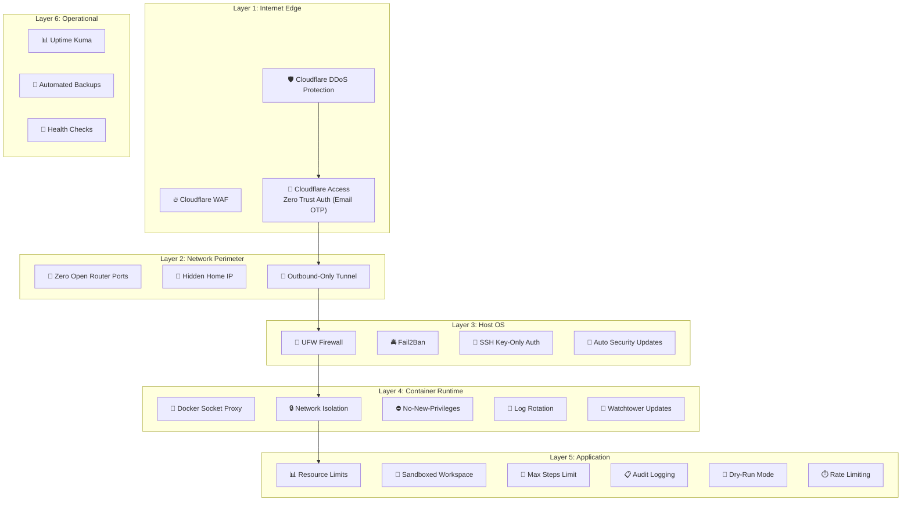

# Homelab Security Deep Dive 🛡️🔍

Great — now that your homelab is fully operational, let's take a step back and look at your security posture holistically. We've built 23 security layers across 7 phases, but security isn't a "set it and forget it" thing — it's an ongoing practice.

Let's organize this into a comprehensive security review.

---

## Your Current Security Architecture



This is a **defense-in-depth** architecture — an attacker would need to breach multiple independent layers to compromise your homelab. Let's examine each layer and identify where we can strengthen things further.

---

## Security Assessment: What's Strong, What Could Be Better

| Area | Current State | Rating | Improvement Available? |
|---|---|---|---|
| **External access** | Cloudflare Tunnel + Access | ⭐⭐⭐⭐⭐ | Minor tweaks |
| **Network perimeter** | Zero open ports, hidden IP | ⭐⭐⭐⭐⭐ | Solid |
| **SSH hardening** | Key-only, no root, Fail2Ban | ⭐⭐⭐⭐ | Can add more |
| **Firewall** | UFW basic rules | ⭐⭐⭐ | Can improve significantly |
| **Docker security** | Socket proxy, no-new-privileges | ⭐⭐⭐⭐ | Can add scanning |
| **Container images** | Using public images | ⭐⭐⭐ | Can add verification |
| **Secrets management** | .env files with chmod 600 | ⭐⭐⭐ | Can upgrade |
| **Monitoring & alerting** | Uptime Kuma | ⭐⭐⭐ | Can add intrusion detection |
| **Backup security** | Local + git (no encryption) | ⭐⭐ | Should encrypt |
| **AI agent security** | Sandbox + limits + audit | ⭐⭐⭐⭐ | Can add approval workflows |
| **Internal TLS** | Not implemented | ⭐⭐ | Should add |
| **User account security** | Single user, sudo access | ⭐⭐⭐ | Can harden |

---

## Let's Strengthen Each Area

I'll organize the improvements by effort level so you can prioritize:

| Effort | Time | Improvements |
|---|---|---|
| 🟢 **Quick Wins** | 15-30 min each | Immediate security gains |
| 🟡 **Medium Effort** | 1-2 hours each | Significant hardening |
| 🔴 **Advanced** | Half day+ | Enterprise-grade security |

---

## 🟢 Quick Wins (Do These First)

### 1. Harden SSH Further

We have key-only auth and Fail2Ban, but we can tighten more:

```bash
sudo nano /etc/ssh/sshd_config
```

Add or modify these settings:

```bash
# ============================================
# SSH Hardening — Beyond the Basics
# ============================================

# Disable root login (already done, but verify)
PermitRootLogin no

# Disable password auth (already done, but verify)
PasswordAuthentication no

# Disable empty passwords
PermitEmptyPasswords no

# Disable X11 forwarding (you don't need GUI forwarding)
X11Forwarding no

# Disable TCP forwarding (unless you specifically need SSH tunnels)
AllowTcpForwarding no

# Disable agent forwarding
AllowAgentForwarding no

# Set maximum authentication attempts per connection
MaxAuthTries 3

# Set login grace time (seconds to authenticate before disconnect)
LoginGraceTime 30

# Only allow your specific user
AllowUsers yourusername

# Use only strong key exchange algorithms
KexAlgorithms curve25519-sha256,curve25519-sha256@libssh.org
Ciphers chacha20-poly1305@openssh.com,aes256-gcm@openssh.com,aes128-gcm@openssh.com
MACs hmac-sha2-512-etm@openssh.com,hmac-sha2-256-etm@openssh.com

# Disconnect idle sessions after 10 minutes
ClientAliveInterval 300
ClientAliveCountMax 2

# Log more detail
LogLevel VERBOSE
```

> 💡 **Why `AllowUsers`?** Even if someone creates a new user account on your system, they can't SSH in unless they're on this list. It's an explicit allowlist.

> 💡 **Why restrict algorithms?** Older SSH algorithms have known weaknesses. By specifying only modern, strong algorithms, we eliminate downgrade attacks [3][4].

```bash
# Validate the config before restarting (prevents lockout!)
sudo sshd -t

# If no errors, restart SSH
sudo systemctl restart ssh
```

> ⚠️ **Test from a NEW terminal before closing your current session!** If something is misconfigured, you could lock yourself out.

### 2. Strengthen Fail2Ban

Our current config only protects SSH. Let's expand it:

```bash
sudo nano /etc/fail2ban/jail.local
```

Add these jails:

```ini
# ============================================
# SSH — Strengthened
# ============================================
[sshd]
enabled = true
port = ssh
filter = sshd
logpath = /var/log/auth.log
maxretry = 3
bantime = 3600
findtime = 600

# Aggressive ban for repeat offenders
[sshd-aggressive]
enabled = true
port = ssh
filter = sshd
logpath = /var/log/auth.log
maxretry = 6
bantime = 86400
findtime = 86400

# ============================================
# Ban persistent attackers for a week
# ============================================
[recidive]
enabled = true
logpath = /var/log/fail2ban.log
banaction = %(banaction_allports)s
bantime = 604800
findtime = 86400
maxretry = 3
```

> 💡 **What's `recidive`?** It monitors Fail2Ban's own log. If an IP gets banned 3 times in 24 hours, it gets banned for an entire week across ALL ports. This catches persistent attackers who keep coming back.

```bash
sudo systemctl restart fail2ban
sudo fail2ban-client status
```

### 3. Enable UFW Logging

```bash
# Enable firewall logging
sudo ufw logging medium

# Logs will appear in /var/log/ufw.log
# Check for suspicious activity
sudo tail -f /var/log/ufw.log
```

### 4. Disable Unnecessary Services

```bash
# List all listening services
sudo ss -tlnp

# List all enabled services
systemctl list-unit-files --state=enabled
```

Review the output. If you see services you don't recognize or need, disable them:

```bash
# Example: disable a service you don't need
# sudo systemctl disable --now service-name
```

> 💡 **Principle of minimal attack surface** — every running service is a potential entry point. If you don't need it, turn it off [4].

### 5. Set Up Automatic Reboot After Kernel Updates

```bash
sudo nano /etc/apt/apt.conf.d/50unattended-upgrades
```

Find and uncomment/modify:

```
// Automatically reboot if required after updates
Unattended-Upgrade::Automatic-Reboot "true";

// Reboot at 5 AM (after backups at 3 AM, before you wake up)
Unattended-Upgrade::Automatic-Reboot-Time "05:00";
```

> 💡 **Why?** Kernel security patches only take effect after a reboot. Without this, your server could be running a vulnerable kernel for weeks.

---

## 🟡 Medium Effort Improvements

### 6. Encrypt Your Backups

Currently, your backups are unencrypted. If someone gets access to the backup files, they have your entire homelab configuration.

```bash
nano ~/homelab/scripts/backup.sh
```

Replace the final archive step with an encrypted version:

```bash
# ============================================
# Step 3: Create ENCRYPTED final archive
# ============================================
echo "[3/3] Creating encrypted archive..."

# Create the unencrypted archive first
tar czf "${BACKUP_FILE}.tmp" \
    -C /home/$(whoami) homelab/ \
    -C "${TEMP_DIR}" . \
    --exclude='homelab/.git' \
    --exclude='homelab/*/.env'

# Encrypt with GPG using a symmetric passphrase
# The passphrase is read from a file (not hardcoded in the script)
gpg --batch --yes --symmetric \
    --cipher-algo AES256 \
    --passphrase-file /home/$(whoami)/.backup-passphrase \
    --output "${BACKUP_FILE}.gpg" \
    "${BACKUP_FILE}.tmp"

# Remove the unencrypted temp file
rm -f "${BACKUP_FILE}.tmp"

echo "Encrypted backup: ${BACKUP_FILE}.gpg"
```

Create the passphrase file:

```bash
# Generate a strong random passphrase
openssl rand -base64 32 > ~/.backup-passphrase
chmod 600 ~/.backup-passphrase

# IMPORTANT: Save this passphrase in your password manager too!
cat ~/.backup-passphrase
```

To restore from an encrypted backup:

```bash
# Decrypt
gpg --batch --passphrase-file ~/.backup-passphrase \
    --output restored-backup.tar.gz \
    --decrypt backup-file.tar.gz.gpg

# Extract
tar xzf restored-backup.tar.gz
```

### 7. Container Image Scanning with Trivy

Trivy is a free, open-source vulnerability scanner for container images. It checks for known CVEs (Common Vulnerabilities and Exposures) in the software inside your containers [1].

```bash
# Install Trivy
sudo apt install -y wget apt-transport-https gnupg lsb-release
wget -qO - https://aquasecurity.github.io/trivy-repo/deb/public.key | sudo gpg --dearmor -o /usr/share/keyrings/trivy.gpg
echo "deb [signed-by=/usr/share/keyrings/trivy.gpg] https://aquasecurity.github.io/trivy-repo/deb $(lsb_release -sc) main" | sudo tee /etc/apt/sources.list.d/trivy.list
sudo apt update
sudo apt install -y trivy
```

Create a scanning script:

```bash
nano ~/homelab/scripts/scan-images.sh
```

```bash
#!/bin/bash
# ~/homelab/scripts/scan-images.sh
# Scan all running container images for vulnerabilities

echo "=========================================="
echo "🔍 CONTAINER IMAGE SECURITY SCAN"
echo "$(date)"
echo "=========================================="

# Get all unique images from running containers
IMAGES=$(docker ps --format '{{.Image}}' | sort -u)

TOTAL_CRITICAL=0
TOTAL_HIGH=0

for IMAGE in $IMAGES; do
    echo ""
    echo "Scanning: $IMAGE"
    echo "------------------------------------------"
    
    # Run Trivy scan — only show HIGH and CRITICAL vulnerabilities
    RESULT=$(trivy image --severity HIGH,CRITICAL --quiet "$IMAGE" 2>/dev/null)
    
    CRITICAL=$(echo "$RESULT" | grep -c "CRITICAL" || true)
    HIGH=$(echo "$RESULT" | grep -c "HIGH" || true)
    
    if [ "$CRITICAL" -gt 0 ] || [ "$HIGH" -gt 0 ]; then
        echo "  ⚠️  CRITICAL: $CRITICAL | HIGH: $HIGH"
        echo "$RESULT" | head -20
    else
        echo "  ✅ No HIGH or CRITICAL vulnerabilities found"
    fi
    
    TOTAL_CRITICAL=$((TOTAL_CRITICAL + CRITICAL))
    TOTAL_HIGH=$((TOTAL_HIGH + HIGH))
done

echo ""
echo "=========================================="
echo "SUMMARY: $TOTAL_CRITICAL CRITICAL | $TOTAL_HIGH HIGH"
if [ "$TOTAL_CRITICAL" -gt 0 ]; then
    echo "🚨 ACTION REQUIRED: Critical vulnerabilities found!"
elif [ "$TOTAL_HIGH" -gt 0 ]; then
    echo "⚠️  Review HIGH vulnerabilities when possible"
else
    echo "✅ All images look clean!"
fi
echo "=========================================="
```

```bash
chmod +x ~/homelab/scripts/scan-images.sh

# Run a scan now
~/homelab/scripts/scan-images.sh

# Add to weekly cron
crontab -e
```

Add:

```
# Weekly container image security scan (Sunday 6 AM)
0 6 * * 0 /home/youruser/homelab/scripts/scan-images.sh >> /home/youruser/backups/scan.log 2>&1
```

> 💡 **This is the homelab equivalent of what Iron Bank does for the Department of Defense** — scanning container images for vulnerabilities before they're deployed [1]. You're applying the same principle at a personal scale.

### 8. Intrusion Detection with AIDE

AIDE (Advanced Intrusion Detection Environment) monitors your filesystem for unauthorized changes. If someone modifies a system binary, config file, or installs a rootkit, AIDE will detect it.

```bash
# Install AIDE
sudo apt install -y aide

# Initialize the database (takes a few minutes — it catalogs your entire filesystem)
sudo aideinit

# The database is created at /var/lib/aide/aide.db.new
# Move it to the active location
sudo cp /var/lib/aide/aide.db.new /var/lib/aide/aide.db
```

Create a check script:

```bash
nano ~/homelab/scripts/aide-check.sh
```

```bash
#!/bin/bash
# ~/homelab/scripts/aide-check.sh
# Check for unauthorized filesystem changes

echo "🔍 Running AIDE integrity check..."
RESULT=$(sudo aide --check 2>&1)
CHANGES=$(echo "$RESULT" | grep -c "changed\|added\|removed" || true)

if [ "$CHANGES" -gt 0 ]; then
    echo "⚠️  AIDE detected filesystem changes!"
    echo "$RESULT" | tail -30
    
    # Send alert (uncomment and configure your preferred method)
    # curl -H "Content-Type: application/json" \
    #   -d "{\"content\": \"⚠️ AIDE detected $CHANGES filesystem changes on homelab server!\"}" \
    #   YOUR_DISCORD_WEBHOOK_URL
else
    echo "✅ No unauthorized changes detected"
fi
```

```bash
chmod +x ~/homelab/scripts/aide-check.sh

# Add to daily cron (run after backups, before updates)
crontab -e
```

Add:

```
# Daily filesystem integrity check (3:30 AM)
30 3 * * * /home/youruser/homelab/scripts/aide-check.sh >> /home/youruser/backups/aide.log 2>&1
```

> ⚠️ **Important:** After legitimate system changes (apt upgrades, new software), you need to update the AIDE database:
> ```bash
> sudo aide --update
> sudo cp /var/lib/aide/aide.db.new /var/lib/aide/aide.db
> ```

### 9. Network Monitoring with Netdata

Netdata gives you real-time, granular system monitoring with beautiful dashboards — CPU, RAM, disk, network, Docker containers, GPU, and more. It's like `htop` on steroids with a web UI.

```bash
cd ~/homelab/monitoring
nano docker-compose.yml
```

Add Netdata to your monitoring stack:

```yaml
  netdata:
    image: netdata/netdata:stable
    container_name: netdata
    restart: unless-stopped
    pid: host                          # Required for process monitoring
    cap_add:
      - SYS_PTRACE                     # Required for process monitoring
      - SYS_ADMIN                      # Required for some collectors
    security_opt:
      - apparmor:unconfined            # Required on Ubuntu
    volumes:
      - netdata_config:/etc/netdata
      - netdata_lib:/var/lib/netdata
      - netdata_cache:/var/cache/netdata
      - /etc/passwd:/host/etc/passwd:ro
      - /etc/group:/host/etc/group:ro
      - /etc/localtime:/etc/localtime:ro
      - /proc:/host/proc:ro
      - /sys:/host/sys:ro
      - /var/run/docker.sock:/var/run/docker.sock:ro
    environment:
      - NETDATA_CLAIM_TOKEN=            # Leave empty for local-only
      - DOCKER_HOST=/var/run/docker.sock
    expose:
      - "19999"
    networks:
      - homelab-net
    labels:
      - "com.centurylinklabs.watchtower.enable=true"
```

> ⚠️ **Security tradeoff:** Netdata needs more permissions than our other containers (SYS_PTRACE, SYS_ADMIN, Docker socket access) because it monitors the entire system. This is acceptable for a monitoring tool on a single-user homelab, but be aware of the elevated access. It's exposed only via `homelab-net` and protected by Cloudflare Access.

Add the volume declarations:

```yaml
volumes:
  uptime_kuma_data:
  netdata_config:
  netdata_lib:
  netdata_cache:
```

Add a Caddy route and Cloudflare hostname:

```bash
cd ~/homelab/proxy
nano Caddyfile
```

```
# Add this route
netdata.yourdomain.com {
    reverse_proxy netdata:19999
}
```

Add the public hostname in Cloudflare (same process as before: subdomain `netdata`, service `HTTP`, URL `caddy:80`).

```bash
# Deploy
cd ~/homelab/monitoring
docker compose up -d

# Reload Caddy
docker exec caddy caddy reload --config /etc/caddy/Caddyfile
```

Access at `https://netdata.yourdomain.com` — you'll get real-time dashboards showing everything happening on your server.

### 10. Cloudflare Access Hardening

Let's strengthen the authentication layer:

1. Go to **Cloudflare Dashboard → Zero Trust → Settings → Authentication**
2. Add a second authentication method:
   - **GitHub OAuth** — if you have a GitHub account, this adds a second factor
   - **Google OAuth** — use your Google account
3. Go to **Access → Applications → Your Homelab App**
4. Edit the policy to require **multiple conditions**:

| Rule | Type | Value |
|---|---|---|
| Include | Emails | your@email.com |
| Include | Login Methods | GitHub OR Google |
| Require | Country | Your country code (e.g., US) |

> 💡 **Why add country restriction?** If someone somehow gets your email OTP code, they'd also need to be in your country. This blocks most credential theft attacks originating from overseas.

5. **Session duration:** Consider reducing from 24 hours to **8 hours** for sensitive services (OpenClaw, Netdata)

6. **Enable session logging:**
   - Go to **Zero Trust → Logs → Access Requests**
   - Review periodically for unexpected access attempts

---

## 🔴 Advanced Improvements

### 11. Secrets Management with Docker Secrets or Infisical

Your current `.env` files work, but they have limitations:
- They sit on disk in plaintext (even with chmod 600)
- They're loaded as environment variables (visible via `docker inspect`)
- No audit trail of who accessed them

**Option A: Docker Secrets (simpler)**

For Docker Compose, you can use file-based secrets:

```yaml
services:
  openclaw:
    # ... existing config ...
    secrets:
      - youtube_credentials
      - twitter_credentials
      - facebook_credentials

secrets:
  youtube_credentials:
    file: ./secrets/youtube.txt
  twitter_credentials:
    file: ./secrets/twitter.txt
  facebook_credentials:
    file: ./secrets/facebook.txt
```

Secrets are mounted at `/run/secrets/<name>` inside the container as files (not environment variables), and they're stored in a tmpfs (RAM-based filesystem) — they never touch disk inside the container.

**Option B: Infisical (more robust, still free & self-hosted)**

Infisical is an open-source secrets manager you can self-host:

```yaml
# Would be added to ~/homelab/monitoring/docker-compose.yml
  infisical:
    image: infisical/infisical:latest
    container_name: infisical
    restart: unless-stopped
    expose:
      - "8080"
    volumes:
      - infisical_data:/app/data
    networks:
      - homelab-net
```

This gives you a web UI for managing secrets, audit logs, rotation, and versioning. It's overkill for now but worth knowing about for your future multi-agent expansion.

> 🏆 **My recommendation:** Switch to Docker file-based secrets (Option A) now. It's a small change with meaningful security improvement. Consider Infisical when you expand to multiple agents.

### 12. CrowdSec — Community-Powered Intrusion Prevention

CrowdSec is like Fail2Ban on steroids — it's a free, open-source security engine that:
- Detects attacks like Fail2Ban
- Shares threat intelligence with a global community
- Receives blocklists of known attacker IPs from other CrowdSec users
- Supports Docker-native deployment

```bash
cd ~/homelab/monitoring
nano docker-compose.yml
```

Add CrowdSec:

```yaml
  crowdsec:
    image: crowdsecurity/crowdsec:latest
    container_name: crowdsec
    restart: unless-stopped
    environment:
      - COLLECTIONS=crowdsecurity/linux
      - GID=1000
    volumes:
      - crowdsec_config:/etc/crowdsec
      - crowdsec_data:/var/lib/crowdsec/data
      - /var/log:/var/log:ro                    # Read system logs
    expose:
      - "8080"
    networks:
      - homelab-net
    security_opt:
      - no-new-privileges:true

  # CrowdSec bouncer for Caddy (blocks bad IPs at the proxy level)
  crowdsec-bouncer:
    image: fbonalair/traefik-crowdsec-bouncer:latest
    container_name: crowdsec-bouncer
    restart: unless-stopped
    environment:
      - CROWDSEC_BOUNCER_API_KEY=your-bouncer-key
      - CROWDSEC_AGENT_HOST=crowdsec:8080
    networks:
      - homelab-net
    depends_on:
      - crowdsec
```

> 💡 **How CrowdSec differs from Fail2Ban:** Fail2Ban only knows about attacks on YOUR server. CrowdSec shares intelligence — if an IP attacks someone else's CrowdSec-protected server, your server learns about it too and preemptively blocks that IP. It's collective defense.

This is an advanced setup that requires additional Caddy configuration. I'd recommend tackling this after you're comfortable with everything else.

---

## Updated Security Operations Schedule

Here's your complete security operations calendar:

| Time | Daily | Weekly | Monthly |
|---|---|---|---|
| **3:00 AM** | 💾 Automated backup | | |
| **3:30 AM** | 🔍 AIDE integrity check | | |
| **4:00 AM** | 🔄 Watchtower image updates | | |
| **5:00 AM** | 🔄 Auto-reboot if kernel updated | | |
| **Sunday 6 AM** | | 🔍 Container image scan (Trivy) | |
| **Manual** | | | 📋 Review Cloudflare Access logs |
| **Manual** | | | 📋 Review Fail2Ban/CrowdSec stats |
| **Manual** | | | 🔄 Update AIDE database after changes |
| **Manual** | | | 🔑 Rotate API tokens if needed |

---

## Updated Health Check Script

```bash
nano ~/homelab/scripts/healthcheck.sh
```

Add a security section:

```bash
echo ""
echo "🛡️ SECURITY STATUS"
echo "------------------------------------------"

# Fail2Ban
BANNED=$(sudo fail2ban-client status sshd 2>/dev/null | grep "Currently banned" | awk '{print $NF}')
TOTAL_BANNED=$(sudo fail2ban-client status sshd 2>/dev/null | grep "Total banned" | awk '{print $NF}')
echo "Fail2Ban SSH: ${BANNED:-0} currently banned, ${TOTAL_BANNED:-0} total"

# Check for recidive bans
RECIDIVE=$(sudo fail2ban-client status recidive 2>/dev/null | grep "Currently banned" | awk '{print $NF}')
echo "Fail2Ban Recidive: ${RECIDIVE:-0} repeat offenders banned"

# UFW status
UFW_STATUS=$(sudo ufw status | head -1)
echo "Firewall: $UFW_STATUS"

# Last AIDE check
AIDE_LAST=$(ls -lt ~/backups/aide.log 2>/dev/null | head -1 | awk '{print $6, $7, $8}')
echo "Last AIDE check: ${AIDE_LAST:-Never run}"

# Last image scan
SCAN_LAST=$(ls -lt ~/backups/scan.log 2>/dev/null | head -1 | awk '{print $6, $7, $8}')
echo "Last image scan: ${SCAN_LAST:-Never run}"

# Check for pending security updates
SECURITY_UPDATES=$(apt list --upgradable 2>/dev/null | grep -c security || true)
echo "Pending security updates: $SECURITY_UPDATES"

# SSH login attempts today
SSH_ATTEMPTS=$(sudo grep "$(date +%b\ %d)" /var/log/auth.log 2>/dev/null | grep -c "Failed\|Invalid" || true)
echo "Failed SSH attempts today: $SSH_ATTEMPTS"

# Check backup encryption
LATEST_BACKUP=$(ls -t ~/backups/homelab-backup-*.gpg 2>/dev/null | head -1)
if [ -n "$LATEST_BACKUP" ]; then
    echo "Latest backup: $(basename $LATEST_BACKUP) ✅ Encrypted"
else
    LATEST_BACKUP=$(ls -t ~/backups/homelab-backup-*.tar.gz 2>/dev/null | head -1)
    if [ -n "$LATEST_BACKUP" ]; then
        echo "Latest backup: $(basename $LATEST_BACKUP) ⚠️ NOT encrypted"
    else
        echo "Latest backup: ❌ None found!"
    fi
fi
```

---

## Security Layers — Updated Count: 30

| # | Layer | Category | Phase |
|---|---|---|---|
| 1 | SSH key-only auth (Ed25519) | Host | Phase 1 |
| 2 | UFW firewall | Host | Phase 1 |
| 3 | Fail2Ban (SSH) | Host | Phase 1 |
| 4 | Auto OS security updates | Host | Phase 1 |
| 5 | Docker log rotation | Container | Phase 2 |
| 6 | Docker network isolation | Container | Phase 2 |
| 7 | Container no-new-privileges | Container | Phase 2 |
| 8 | Zero open router ports | Network | Phase 3 |
| 9 | Hidden home IP | Network | Phase 3 |
| 10 | Cloudflare DDoS protection | Network | Phase 3 |
| 11 | Cloudflare Access Zero Trust | Auth | Phase 3 |
| 12 | Secrets in .env files | Secrets | Phase 3 |
| 13 | Restrictive file permissions | Secrets | Phase 3 |
| 14 | Watchtower auto-updates | Container | Phase 4 |
| 15 | Docker socket proxy | Container | Phase 4 |
| 16 | Uptime Kuma monitoring | Operational | Phase 4 |
| 17 | Automated backups | Operational | Phase 4 |
| 18 | Agent resource limits | Application | Phase 6 |
| 19 | Agent max steps limit | Application | Phase 6 |
| 20 | Sandboxed workspace | Application | Phase 6 |
| 21 | Audit logging | Application | Phase 6 |
| 22 | Dry-run mode | Application | Phase 7 |
| 23 | Rate limiting | Application | Phase 7 |
| 24 | **SSH algorithm hardening** | **Host** | **Security Deep Dive** |
| 25 | **Fail2Ban recidive (repeat offender bans)** | **Host** | **Security Deep Dive** |
| 26 | **Encrypted backups (GPG/AES-256)** | **Operational** | **Security Deep Dive** |
| 27 | **Container image scanning (Trivy)** | **Container** | **Security Deep Dive** |
| 28 | **Filesystem integrity monitoring (AIDE)** | **Host** | **Security Deep Dive** |
| 29 | **Auto-reboot after kernel updates** | **Host** | **Security Deep Dive** |
| 30 | **Cloudflare Access hardening (multi-auth + geo)** | **Auth** | **Security Deep Dive** |

Optional advanced layers available:
- Netdata (real-time system monitoring)
- Docker Secrets (improved secrets management)
- CrowdSec (community-powered intrusion prevention)
- Infisical (self-hosted secrets manager)

---

## Commit Your Progress

```bash
cd ~/homelab
git add .
git commit -m "Security deep dive: SSH hardening, encrypted backups, Trivy scanning, AIDE, Fail2Ban recidive"
```

---

## Recommended Implementation Order

Here's my suggested priority for implementing these improvements:

| Priority | Improvement | Why First |
|---|---|---|
| 1️⃣ | SSH hardening (algorithms, AllowUsers) | 15 minutes, huge impact |
| 2️⃣ | Fail2Ban recidive | 10 minutes, catches persistent attackers |
| 3️⃣ | Encrypted backups | 20 minutes, protects your data at rest |
| 4️⃣ | Auto-reboot after kernel updates | 5 minutes, ensures patches take effect |
| 5️⃣ | UFW logging | 5 minutes, visibility into blocked traffic |
| 6️⃣ | Cloudflare Access hardening | 15 minutes, stronger authentication |
| 7️⃣ | Trivy image scanning | 30 minutes, catches vulnerable containers |
| 8️⃣ | AIDE integrity monitoring | 30 minutes, detects unauthorized changes |
| 9️⃣ | Netdata | 30 minutes, deep system visibility |
| 🔟 | CrowdSec | 1-2 hours, community threat intelligence |

---

**Would you like to dive deeper into any specific security area? For example:**
- 🔍 **Threat modeling** — what specific attacks could target your homelab and how each layer defends against them
- 🤖 **AI agent security** — deeper hardening of OpenClaw's capabilities and permissions
- 🌐 **Network security** — VLANs, internal DNS, mTLS between containers
- 📋 **Compliance frameworks** — mapping your security to NIST or CIS benchmarks for professional development
- 🔑 **Identity & access management** — preparing for multi-user scenarios

Let me know what interests you most! 🛡️