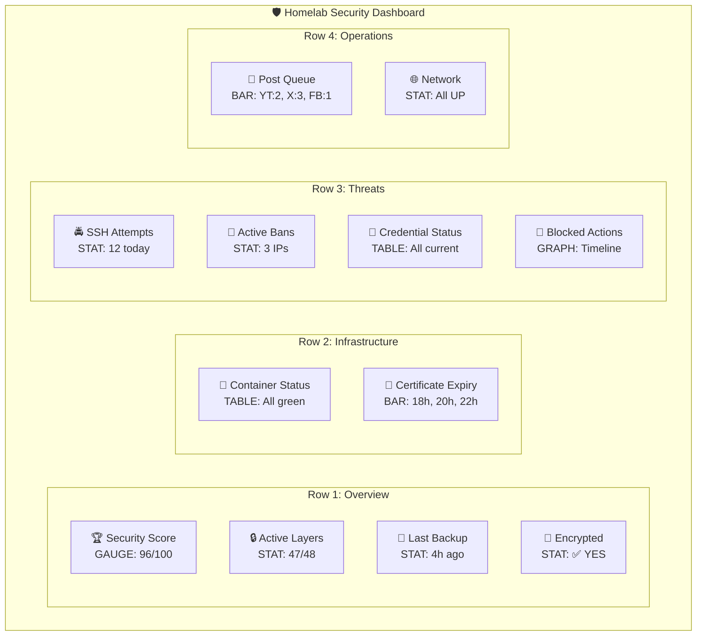

INFO: converting prompt to search query: unified security dashboard features benefits tools comparison

Getting web content for https://www.cisco.com/c/en/us/products/collateral/data-center-analytics/nexus-dashboard/datasheet-c78-744371.html

Getting web content for https://deploylearning.com/google-workspace-for-education-comparing-versions-features/


# Unified Security Dashboard — Single Pane of Glass 📊🛡️

Let's build a centralized dashboard that gives you real-time visibility into all 48 security layers, every service, every credential, every certificate, and every threat indicator — all in one place.

---

## Why a Unified Dashboard?

Right now, your security visibility is fragmented:

| What You Want to Know | Where You Currently Check |
|---|---|
| Are all containers running? | `docker ps` or Uptime Kuma |
| Any failed SSH attempts? | `sudo fail2ban-client status sshd` |
| Are certificates expiring? | `~/homelab/scripts/cert-status.sh` |
| Any blocked agent actions? | `docker compose logs openclaw` |
| Are credentials due for rotation? | `run_rotation.py --status` |
| Container vulnerabilities? | `~/homelab/scripts/scan-images.sh` |
| Filesystem integrity? | `~/homelab/scripts/aide-check.sh` |
| System resources? | `htop` or Netdata |
| Cross-posting automation status? | `crosspost` alias |
| Drift detection alerts? | `~/backups/drift.log` |

That's **10 different places** to check. A unified dashboard consolidates everything into a single view you can glance at in seconds [1][2][5].

---

## Architecture Decision

| Option | Complexity | Resource Usage | Customizability | Cost |
|---|---|---|---|---|
| **Grafana + Prometheus** | ⭐⭐⭐ Medium | Medium (~200MB RAM) | ⭐⭐⭐⭐⭐ Excellent | Free |
| **Homepage (gethomepage.dev)** | ⭐ Very Low | Very low (~50MB RAM) | ⭐⭐⭐ Good | Free |
| **Dashy** | ⭐⭐ Low | Low (~100MB RAM) | ⭐⭐⭐⭐ Very Good | Free |
| **Custom Node.js app** | ⭐⭐⭐⭐ High | Low | ⭐⭐⭐⭐⭐ Maximum | Free |
| **Splunk/ELK Stack** | ⭐⭐⭐⭐⭐ Very High | Very High (2GB+ RAM) | ⭐⭐⭐⭐⭐ Maximum | Free tier limited |

### 🏆 Recommendation: Grafana + Prometheus + Custom Collectors

**Why?**
1. **Grafana** is the industry standard for security dashboards — it's what SOC teams use [7][9]
2. **Prometheus** efficiently collects and stores time-series metrics
3. **Custom collectors** let us feed in data from all our scripts (Fail2Ban, AIDE, Trivy, credential rotation, etc.)
4. **Alerting built-in** — Grafana can send alerts to Discord, email, etc.
5. **Beautiful visualizations** — graphs, gauges, tables, heatmaps
6. **Resource-friendly** — Prometheus + Grafana together use ~300-400MB RAM, well within your 16GB budget
7. **As a web dev**, you'll appreciate that Grafana dashboards are essentially JSON — version-controllable and reproducible

---

## Phase 1: Deploy the Monitoring Stack

### Create the Dashboard Directory

```bash
mkdir -p ~/homelab/dashboard
mkdir -p ~/homelab/dashboard/grafana/provisioning/dashboards
mkdir -p ~/homelab/dashboard/grafana/provisioning/datasources
mkdir -p ~/homelab/dashboard/prometheus
mkdir -p ~/homelab/dashboard/collectors
cd ~/homelab/dashboard
```

### Deploy Prometheus + Grafana

```bash
nano docker-compose.yml
```

```yaml
# ~/homelab/dashboard/docker-compose.yml
# Unified Security Dashboard: Prometheus + Grafana + Custom Collectors

services:
  # ============================================
  # Prometheus — Metrics Collection & Storage
  # ============================================
  prometheus:
    image: prom/prometheus:latest
    container_name: prometheus
    restart: unless-stopped
    
    volumes:
      - ./prometheus/prometheus.yml:/etc/prometheus/prometheus.yml:ro
      - ./prometheus/rules:/etc/prometheus/rules:ro
      - prometheus_data:/prometheus
    
    command:
      - '--config.file=/etc/prometheus/prometheus.yml'
      - '--storage.tsdb.path=/prometheus'
      # Keep 30 days of metrics
      - '--storage.tsdb.retention.time=30d'
      # Limit storage to 5GB
      - '--storage.tsdb.retention.size=5GB'
      - '--web.enable-lifecycle'
    
    expose:
      - "9090"
    
    networks:
      - homelab-net
      - dashboard-net
    
    security_opt:
      - no-new-privileges:true
    
    labels:
      - "com.centurylinklabs.watchtower.enable=true"

  # ============================================
  # Grafana — Visualization & Dashboards
  # ============================================
  grafana:
    image: grafana/grafana-oss:latest
    container_name: grafana
    restart: unless-stopped
    
    volumes:
      - grafana_data:/var/lib/grafana
      - ./grafana/provisioning:/etc/grafana/provisioning:ro
      - ./grafana/dashboards:/var/lib/grafana/dashboards:ro
    
    environment:
      # Admin credentials
      - GF_SECURITY_ADMIN_USER=admin
      - GF_SECURITY_ADMIN_PASSWORD=${GRAFANA_ADMIN_PASSWORD}
      
      # Security settings
      - GF_SECURITY_ALLOW_EMBEDDING=false
      - GF_SECURITY_COOKIE_SECURE=true
      - GF_SECURITY_STRICT_TRANSPORT_SECURITY=true
      
      # Disable public signup
      - GF_USERS_ALLOW_SIGN_UP=false
      - GF_USERS_ALLOW_ORG_CREATE=false
      
      # Disable analytics
      - GF_ANALYTICS_REPORTING_ENABLED=false
      - GF_ANALYTICS_CHECK_FOR_UPDATES=false
      
      # Set timezone
      - GF_DATE_FORMATS_DEFAULT_TIMEZONE=America/New_York
    
    env_file:
      - .env
    
    expose:
      - "3000"
    
    networks:
      - homelab-net
      - dashboard-net
    
    depends_on:
      - prometheus
    
    security_opt:
      - no-new-privileges:true
    
    labels:
      - "com.centurylinklabs.watchtower.enable=true"

  # ============================================
  # Node Exporter — Host System Metrics
  # ============================================
  node-exporter:
    image: prom/node-exporter:latest
    container_name: node-exporter
    restart: unless-stopped
    
    command:
      - '--path.rootfs=/host'
      - '--collector.filesystem.mount-points-exclude=^/(sys|proc|dev|host|etc)($$|/)'
    
    volumes:
      - /:/host:ro,rslave
    
    expose:
      - "9100"
    
    networks:
      - dashboard-net
    
    pid: host
    
    security_opt:
      - no-new-privileges:true

  # ============================================
  # cAdvisor — Container Metrics
  # ============================================
  cadvisor:
    image: gcr.io/cadvisor/cadvisor:latest
    container_name: cadvisor
    restart: unless-stopped
    
    volumes:
      - /:/rootfs:ro
      - /var/run:/var/run:ro
      - /sys:/sys:ro
      - /var/lib/docker/:/var/lib/docker:ro
      - /dev/disk/:/dev/disk:ro
    
    expose:
      - "8080"
    
    networks:
      - dashboard-net
    
    privileged: true
    devices:
      - /dev/kmsg:/dev/kmsg
    
    security_opt:
      - no-new-privileges:true

  # ============================================
  # Custom Security Metrics Collector
  # ============================================
  security-collector:
    build:
      context: ./collectors
      dockerfile: Dockerfile
    container_name: security-collector
    restart: unless-stopped
    
    volumes:
      - /var/log:/host/var/log:ro
      - /var/run/docker.sock:/var/run/docker.sock:ro
      - ~/homelab:/homelab:ro
      - ~/backups:/backups:ro
    
    expose:
      - "9101"
    
    networks:
      - dashboard-net
      - homelab-net
    
    security_opt:
      - no-new-privileges:true

volumes:
  prometheus_data:
  grafana_data:

networks:
  homelab-net:
    external: true
  dashboard-net:
    # Internal network for dashboard components
    internal: true
```

### Create the Environment File

```bash
nano .env
```

```bash
# ~/homelab/dashboard/.env
GRAFANA_ADMIN_PASSWORD=your-strong-grafana-password
```

```bash
chmod 600 .env
```

---

## Phase 2: Configure Prometheus

```bash
nano ~/homelab/dashboard/prometheus/prometheus.yml
```

```yaml
# ~/homelab/dashboard/prometheus/prometheus.yml
# Prometheus configuration — scrapes metrics from all sources

global:
  scrape_interval: 30s
  evaluation_interval: 30s
  scrape_timeout: 10s

# ============================================
# Alert Rules
# ============================================
rule_files:
  - /etc/prometheus/rules/*.yml

# ============================================
# Scrape Targets
# ============================================
scrape_configs:
  # ----------------------------------------
  # Prometheus self-monitoring
  # ----------------------------------------
  - job_name: 'prometheus'
    static_configs:
      - targets: ['localhost:9090']

  # ----------------------------------------
  # Host system metrics (CPU, RAM, disk, network)
  # ----------------------------------------
  - job_name: 'node-exporter'
    static_configs:
      - targets: ['node-exporter:9100']
    relabel_configs:
      - source_labels: [__address__]
        target_label: instance
        replacement: 'homelab-server'

  # ----------------------------------------
  # Docker container metrics
  # ----------------------------------------
  - job_name: 'cadvisor'
    static_configs:
      - targets: ['cadvisor:8080']

  # ----------------------------------------
  # Custom security metrics
  # ----------------------------------------
  - job_name: 'security-collector'
    static_configs:
      - targets: ['security-collector:9101']
    scrape_interval: 60s

  # ----------------------------------------
  # Ollama metrics (if available)
  # ----------------------------------------
  - job_name: 'ollama'
    static_configs:
      - targets: ['ollama:11434']
    metrics_path: /api/tags
    scrape_interval: 120s
```

### Create Alert Rules

```bash
mkdir -p ~/homelab/dashboard/prometheus/rules
nano ~/homelab/dashboard/prometheus/rules/security-alerts.yml
```

```yaml
# ~/homelab/dashboard/prometheus/rules/security-alerts.yml
# Prometheus alerting rules for security events

groups:
  - name: security_alerts
    rules:
      # ============================================
      # Host Security Alerts
      # ============================================
      - alert: HighFailedSSHAttempts
        expr: security_ssh_failed_attempts_today > 50
        for: 5m
        labels:
          severity: warning
        annotations:
          summary: "High number of failed SSH attempts"
          description: "{{ $value }} failed SSH attempts detected today"

      - alert: Fail2BanActiveBans
        expr: security_fail2ban_currently_banned > 5
        for: 1m
        labels:
          severity: info
        annotations:
          summary: "Multiple IPs banned by Fail2Ban"
          description: "{{ $value }} IPs currently banned"

      - alert: AIDEIntegrityViolation
        expr: security_aide_changes_detected > 0
        for: 1m
        labels:
          severity: critical
        annotations:
          summary: "🚨 Filesystem integrity violation detected!"
          description: "AIDE detected {{ $value }} unauthorized changes"

      # ============================================
      # Container Security Alerts
      # ============================================
      - alert: ContainerDown
        expr: security_container_running == 0
        for: 2m
        labels:
          severity: warning
        annotations:
          summary: "Container {{ $labels.container }} is down"
          description: "Container has been down for more than 2 minutes"

      - alert: CriticalVulnerabilities
        expr: security_trivy_critical_vulns > 0
        for: 1m
        labels:
          severity: critical
        annotations:
          summary: "Critical vulnerabilities found in container images"
          description: "{{ $value }} critical vulnerabilities detected"

      # ============================================
      # Certificate Alerts
      # ============================================
      - alert: CertificateExpiringSoon
        expr: security_cert_hours_remaining < 6
        for: 1m
        labels:
          severity: critical
        annotations:
          summary: "Certificate {{ $labels.service }} expiring in {{ $value }}h!"
          description: "mTLS certificate will expire soon"

      - alert: CertificateExpiringWarning
        expr: security_cert_hours_remaining < 12
        for: 5m
        labels:
          severity: warning
        annotations:
          summary: "Certificate {{ $labels.service }} expiring in {{ $value }}h"

      # ============================================
      # Credential Rotation Alerts
      # ============================================
      - alert: CredentialRotationOverdue
        expr: security_credential_days_overdue > 0
        for: 1m
        labels:
          severity: warning
        annotations:
          summary: "Credential {{ $labels.credential }} is overdue for rotation"
          description: "{{ $value }} days overdue"

      # ============================================
      # AI Agent Security Alerts
      # ============================================
      - alert: AgentBlockedActions
        expr: rate(security_agent_blocked_total[1h]) > 5
        for: 5m
        labels:
          severity: warning
        annotations:
          summary: "High rate of blocked agent actions"
          description: "{{ $value }} blocked actions per hour"

      - alert: AgentDriftDetected
        expr: security_agent_drift_score > 50
        for: 1m
        labels:
          severity: warning
        annotations:
          summary: "AI agent behavioral drift detected"
          description: "Drift score: {{ $value }}/100"

      # ============================================
      # Resource Alerts
      # ============================================
      - alert: HighCPUUsage
        expr: 100 - (avg by(instance) (rate(node_cpu_seconds_total{mode="idle"}[5m])) * 100) > 90
        for: 10m
        labels:
          severity: warning
        annotations:
          summary: "CPU usage above 90% for 10 minutes"

      - alert: HighMemoryUsage
        expr: (1 - node_memory_MemAvailable_bytes / node_memory_MemTotal_bytes) * 100 > 90
        for: 5m
        labels:
          severity: critical
        annotations:
          summary: "Memory usage above 90%"

      - alert: DiskSpaceLow
        expr: (1 - node_filesystem_avail_bytes{mountpoint="/"} / node_filesystem_size_bytes{mountpoint="/"}) * 100 > 85
        for: 5m
        labels:
          severity: warning
        annotations:
          summary: "Disk usage above 85%"

      - alert: BackupMissing
        expr: security_backup_age_hours > 36
        for: 1m
        labels:
          severity: critical
        annotations:
          summary: "No backup in the last 36 hours!"
          description: "Last backup was {{ $value }} hours ago"
```

---

## Phase 3: Build the Custom Security Metrics Collector

This is the heart of the unified dashboard — a custom exporter that collects security metrics from all our scripts and exposes them in Prometheus format.

```bash
nano ~/homelab/dashboard/collectors/Dockerfile
```

```dockerfile
# ~/homelab/dashboard/collectors/Dockerfile
# Custom security metrics collector for Prometheus

FROM python:3.12-slim

RUN pip install --no-cache-dir prometheus_client docker

RUN apt-get update && apt-get install -y --no-install-recommends \
    curl \
    sqlite3 \
    openssh-client \
    && rm -rf /var/lib/apt/lists/*

COPY collector.py /app/collector.py

WORKDIR /app

EXPOSE 9101

CMD ["python3", "collector.py"]
```

```bash
nano ~/homelab/dashboard/collectors/collector.py
```

```python
#!/usr/bin/env python3
"""
Unified Security Metrics Collector
Collects security metrics from all homelab sources and
exposes them as Prometheus metrics on port 9101.

This is the data backbone of the unified security dashboard.
"""

import os
import re
import time
import json
import sqlite3
import subprocess
import threading
from datetime import datetime, timedelta
from pathlib import Path
from prometheus_client import (
    start_http_server, Gauge, Counter, Info, Enum,
    CollectorRegistry, REGISTRY
)

# ============================================
# Metric Definitions
# ============================================

# --- Host Security ---
ssh_failed_attempts = Gauge(
    'security_ssh_failed_attempts_today',
    'Number of failed SSH login attempts today'
)
fail2ban_banned = Gauge(
    'security_fail2ban_currently_banned',
    'Number of IPs currently banned by Fail2Ban'
)
fail2ban_total_banned = Gauge(
    'security_fail2ban_total_banned',
    'Total number of IPs banned by Fail2Ban since start'
)
fail2ban_recidive = Gauge(
    'security_fail2ban_recidive_banned',
    'Number of repeat offenders banned by recidive jail'
)
aide_changes = Gauge(
    'security_aide_changes_detected',
    'Number of filesystem changes detected by AIDE'
)
ufw_blocked = Gauge(
    'security_ufw_blocked_today',
    'Number of connections blocked by UFW today'
)
pending_security_updates = Gauge(
    'security_pending_updates',
    'Number of pending security updates'
)

# --- Container Security ---
container_running = Gauge(
    'security_container_running',
    'Whether a container is running (1) or not (0)',
    ['container']
)
container_restart_count = Gauge(
    'security_container_restart_count',
    'Number of times a container has restarted',
    ['container']
)
trivy_critical = Gauge(
    'security_trivy_critical_vulns',
    'Number of critical vulnerabilities in container images'
)
trivy_high = Gauge(
    'security_trivy_high_vulns',
    'Number of high vulnerabilities in container images'
)
watchtower_updates = Gauge(
    'security_watchtower_updates_applied',
    'Number of container updates applied by Watchtower'
)

# --- Certificate Security ---
cert_hours_remaining = Gauge(
    'security_cert_hours_remaining',
    'Hours until certificate expires',
    ['service']
)
ca_health = Gauge(
    'security_ca_healthy',
    'Whether the internal CA is healthy (1) or not (0)'
)

# --- Credential Rotation ---
credential_days_overdue = Gauge(
    'security_credential_days_overdue',
    'Days a credential is overdue for rotation (0 = on schedule)',
    ['credential']
)
credential_last_rotated_days = Gauge(
    'security_credential_last_rotated_days',
    'Days since credential was last rotated',
    ['credential']
)
rotation_success_total = Counter(
    'security_rotation_success_total',
    'Total successful credential rotations',
    ['credential']
)
rotation_failure_total = Counter(
    'security_rotation_failure_total',
    'Total failed credential rotations',
    ['credential']
)

# --- AI Agent Security ---
agent_blocked_total = Counter(
    'security_agent_blocked_total',
    'Total blocked agent actions',
    ['action_type']
)
agent_drift_score = Gauge(
    'security_agent_drift_score',
    'AI agent behavioral drift score (0-100)'
)
agent_tasks_completed = Gauge(
    'security_agent_tasks_completed_today',
    'Number of agent tasks completed today'
)
agent_tasks_failed = Gauge(
    'security_agent_tasks_failed_today',
    'Number of agent tasks failed today'
)
cross_post_queue_depth = Gauge(
    'security_crosspost_queue_depth',
    'Number of pending cross-posts in queue',
    ['platform']
)

# --- Backup Security ---
backup_age_hours = Gauge(
    'security_backup_age_hours',
    'Hours since the last successful backup'
)
backup_size_bytes = Gauge(
    'security_backup_size_bytes',
    'Size of the latest backup in bytes'
)
backup_encrypted = Gauge(
    'security_backup_encrypted',
    'Whether the latest backup is encrypted (1) or not (0)'
)

# --- Network Security ---
cloudflare_tunnel_healthy = Gauge(
    'security_cloudflare_tunnel_healthy',
    'Whether the Cloudflare tunnel is connected (1) or not (0)'
)
ollama_desktop_available = Gauge(
    'security_ollama_desktop_available',
    'Whether the desktop Ollama is reachable (1) or not (0)'
)

# --- Overall Security Score ---
security_score = Gauge(
    'security_overall_score',
    'Overall security health score (0-100)'
)
security_layers_active = Gauge(
    'security_layers_active',
    'Number of security layers currently active'
)


# ============================================
# Collector Functions
# ============================================

def collect_ssh_metrics():
    """Collect SSH and Fail2Ban metrics."""
    try:
        # Failed SSH attempts today
        today = datetime.now().strftime("%b %d").lstrip("0").replace(" 0", "  ")
        result = subprocess.run(
            ["grep", "-c", f"Failed password\|Invalid user",
             "/host/var/log/auth.log"],
            capture_output=True, text=True
        )
        # Count lines matching today's date
        count = 0
        try:
            with open("/host/var/log/auth.log") as f:
                for line in f:
                    if ("Failed password" in line or "Invalid user" in line):
                        count += 1
        except:
            pass
        ssh_failed_attempts.set(count)
    except Exception as e:
        print(f"SSH metrics error: {e}")

    try:
        # Fail2Ban status
        result = subprocess.run(
            ["docker", "exec", "fail2ban-not-in-docker",
             "fail2ban-client", "status", "sshd"],
            capture_output=True, text=True
        )
        # Parse from host log files instead
        # Since fail2ban runs on host, we read its log
        try:
            with open("/host/var/log/fail2ban.log") as f:
                content = f.read()
                bans = content.count("Ban ")
                unbans = content.count("Unban ")
                current = max(0, bans - unbans)
                fail2ban_banned.set(current)
                fail2ban_total_banned.set(bans)
        except:
            fail2ban_banned.set(0)
            fail2ban_total_banned.set(0)
    except Exception as e:
        print(f"Fail2Ban metrics error: {e}")


def collect_container_metrics():
    """Collect Docker container status metrics."""
    try:
        import docker
        client = docker.from_env()
        
        expected_containers = [
            'caddy', 'cloudflared', 'ollama', 'openclaw',
            'uptime-kuma', 'watchtower', 'socket-proxy',
            'step-ca', 'prometheus', 'grafana',
            'security-collector', 'node-exporter', 'cadvisor'
        ]
        
        running_containers = {
            c.name: c for c in client.containers.list()
        }
        
        for name in expected_containers:
            if name in running_containers:
                container_running.labels(container=name).set(1)
                restart_count = running_containers[name].attrs.get(
                    'RestartCount', 0
                )
                container_restart_count.labels(container=name).set(
                    restart_count
                )
            else:
                container_running.labels(container=name).set(0)
                container_restart_count.labels(container=name).set(0)
    except Exception as e:
        print(f"Container metrics error: {e}")


def collect_certificate_metrics():
    """Collect mTLS certificate expiration metrics."""
    services = ['caddy', 'ollama', 'openclaw']
    
    for service in services:
        try:
            result = subprocess.run(
                ["docker", "exec", service,
                 "openssl", "x509", "-in", f"/certs/{service}.crt",
                 "-noout", "-enddate"],
                capture_output=True, text=True
            )
            
            if result.returncode == 0:
                # Parse "notAfter=Mar 21 12:00:00 2026 GMT"
                expiry_str = result.stdout.strip().replace("notAfter=", "")
                expiry = datetime.strptime(
                    expiry_str, "%b %d %H:%M:%S %Y %Z"
                )
                hours_left = (expiry - datetime.utcnow()).total_seconds() / 3600
                cert_hours_remaining.labels(service=service).set(
                    max(0, hours_left)
                )
            else:
                cert_hours_remaining.labels(service=service).set(-1)
        except Exception as e:
            cert_hours_remaining.labels(service=service).set(-1)
    
    # Check CA health
    try:
        result = subprocess.run(
            ["docker", "exec", "step-ca",
             "step", "ca", "health",
             "--ca-url", "https://localhost:9000",
             "--root", "/home/step/certs/root_ca.crt"],
            capture_output=True, text=True
        )
        ca_health.set(1 if result.returncode == 0 else 0)
    except:
        ca_health.set(0)


def collect_credential_rotation_metrics():
    """Collect credential rotation status metrics."""
    try:
        db_path = "/homelab/scripts/credential-rotation/rotation.db"
        if not os.path.exists(db_path):
            return
        
        conn = sqlite3.connect(db_path)
        cursor = conn.cursor()
        
        # Check each scheduled rotation
        cursor.execute("""
            SELECT credential_name, frequency_days, last_rotated, 
                   next_rotation
            FROM rotation_schedule
            WHERE enabled = 1
        """)
        
        for name, freq, last_rotated, next_rotation in cursor.fetchall():
            if last_rotated:
                last_dt = datetime.fromisoformat(last_rotated)
                days_since = (datetime.now() - last_dt).days
                credential_last_rotated_days.labels(
                    credential=name
                ).set(days_since)
            
            if next_rotation:
                next_dt = datetime.fromisoformat(next_rotation)
                days_overdue = max(
                    0, (datetime.now() - next_dt).days
                )
                credential_days_overdue.labels(
                    credential=name
                ).set(days_overdue)
        
        # Count successes and failures
        cursor.execute("""
            SELECT credential_name, status, COUNT(*)
            FROM rotation_log
            GROUP BY credential_name, status
        """)
        
        for name, status, count in cursor.fetchall():
            if status == 'success':
                rotation_success_total.labels(credential=name)._value.set(count)
            elif 'failed' in status:
                rotation_failure_total.labels(credential=name)._value.set(count)
        
        conn.close()
    except Exception as e:
        print(f"Credential rotation metrics error: {e}")


def collect_agent_metrics():
    """Collect AI agent security metrics."""
    try:
        db_path = "/homelab/openclaw/data/content_tracker.db"
        
        # Try to find the database via Docker volume
        result = subprocess.run(
            ["docker", "exec", "openclaw",
             "sqlite3", "/app/data/content_tracker.db",
             "SELECT action, status, COUNT(*) FROM agent_log "
             "WHERE created_at > datetime('now', '-1 day') "
             "GROUP BY action, status"],
            capture_output=True, text=True
        )
        
        if result.returncode == 0:
            for line in result.stdout.strip().split('\n'):
                if not line:
                    continue
                parts = line.split('|')
                if len(parts) == 3:
                    action, status, count = parts
                    if status == 'blocked':
                        agent_blocked_total.labels(
                            action_type=action
                        )._value.set(int(count))
        
        # Cross-post queue depth
        result = subprocess.run(
            ["docker", "exec", "openclaw",
             "sqlite3", "/app/data/content_tracker.db",
             "SELECT target_platform, COUNT(*) FROM cross_posts "
             "WHERE status IN ('pending', 'captioned') "
             "GROUP BY target_platform"],
            capture_output=True, text=True
        )
        
        if result.returncode == 0:
            for line in result.stdout.strip().split('\n'):
                if not line:
                    continue
                parts = line.split('|')
                if len(parts) == 2:
                    platform, count = parts
                    cross_post_queue_depth.labels(
                        platform=platform
                    ).set(int(count))
    except Exception as e:
        print(f"Agent metrics error: {e}")


def collect_backup_metrics():
    """Collect backup status metrics."""
    try:
        import glob
        
        # Find latest backup
        backups_gpg = sorted(glob.glob("/backups/homelab-backup-*.gpg"))
        backups_tar = sorted(glob.glob("/backups/homelab-backup-*.tar.gz"))
        
        latest = None
        is_encrypted = False
        
        if backups_gpg:
            latest = backups_gpg[-1]
            is_encrypted = True
        elif backups_tar:
            latest = backups_tar[-1]
            is_encrypted = False
        
        if latest:
            mtime = os.path.getmtime(latest)
            age_hours = (time.time() - mtime) / 3600
            backup_age_hours.set(age_hours)
            backup_size_bytes.set(os.path.getsize(latest))
            backup_encrypted.set(1 if is_encrypted else 0)
        else:
            backup_age_hours.set(999)
            backup_size_bytes.set(0)
            backup_encrypted.set(0)
    except Exception as e:
        print(f"Backup metrics error: {e}")


def collect_network_metrics():
    """Collect network security metrics."""
    try:
        # Check Cloudflare tunnel
        result = subprocess.run(
            ["docker", "logs", "--tail", "5", "cloudflared"],
            capture_output=True, text=True
        )
        tunnel_ok = "Connection" in result.stdout or \
                    "Registered" in result.stdout
        cloudflare_tunnel_healthy.set(1 if tunnel_ok else 0)
    except:
        cloudflare_tunnel_healthy.set(0)
    
    try:
        # Check desktop Ollama
        desktop_ip = os.environ.get("DESKTOP_OLLAMA_IP", "192.168.1.XXX")
        result = subprocess.run(
            ["curl", "-s", "--connect-timeout", "3",
             f"http://{desktop_ip}:11434/api/tags"],
            capture_output=True, text=True
        )
        ollama_desktop_available.set(
            1 if result.returncode == 0 else 0
        )
    except:
        ollama_desktop_available.set(0)


def calculate_security_score():
    """
    Calculate an overall security health score (0-100).
    This is a weighted composite of all security indicators.
    """
    score = 100
    active_layers = 48  # Start with total layers
    
    deductions = {
        # Critical deductions (10 points each)
        'aide_violation': (aide_changes._value.get(), 10),
        'no_backup': (1 if backup_age_hours._value.get() > 36 else 0, 10),
        'ca_down': (1 if ca_health._value.get() == 0 else 0, 10),
        'tunnel_down': (
            1 if cloudflare_tunnel_healthy._value.get() == 0 else 0, 10
        ),
        
        # Warning deductions (5 points each)
        'unencrypted_backup': (
            1 if backup_encrypted._value.get() == 0 else 0, 5
        ),
        'high_ssh_attempts': (
            1 if ssh_failed_attempts._value.get() > 100 else 0, 5
        ),
        'pending_updates': (
            1 if pending_security_updates._value.get() > 5 else 0, 5
        ),
        
        # Minor deductions (2 points each)
        'credential_overdue': (
            min(1, sum(
                1 for m in credential_days_overdue._metrics.values()
                if m._value.get() > 0
            )), 2
        ),
    }
    
    for name, (triggered, points) in deductions.items():
        if triggered:
            score -= points
            active_layers -= 1
    
    security_score.set(max(0, score))
    security_layers_active.set(active_layers)


# ============================================
# Main Collection Loop
# ============================================

def collect_all():
    """Run all collectors."""
    print(f"[{datetime.now().isoformat()}] Collecting metrics...")
    
    collect_ssh_metrics()
    collect_container_metrics()
    collect_certificate_metrics()
    collect_credential_rotation_metrics()
    collect_agent_metrics()
    collect_backup_metrics()
    collect_network_metrics()
    calculate_security_score()
    
    print(f"[{datetime.now().isoformat()}] Collection complete")


if __name__ == '__main__':
    print("🛡️ Security Metrics Collector starting on port 9101...")
    
    # Start the Prometheus HTTP server
    start_http_server(9101)
    
    # Initial collection
    collect_all()
    
    # Collect every 60 seconds
    while True:
        time.sleep(60)
        try:
            collect_all()
        except Exception as e:
            print(f"Collection error: {e}")
```

### Build the Collector

```bash
cd ~/homelab/dashboard/collectors
docker build -t homelab/security-collector:latest .
```

---

## Phase 4: Configure Grafana Data Sources & Dashboards

### Auto-Provision Prometheus Data Source

```bash
nano ~/homelab/dashboard/grafana/provisioning/datasources/prometheus.yml
```

```yaml
# Auto-provision Prometheus as a data source
apiVersion: 1

datasources:
  - name: Prometheus
    type: prometheus
    access: proxy
    url: http://prometheus:9090
    isDefault: true
    editable: false
```

### Auto-Provision Dashboard

```bash
nano ~/homelab/dashboard/grafana/provisioning/dashboards/dashboards.yml
```

```yaml
apiVersion: 1

providers:
  - name: 'Homelab Security'
    orgId: 1
    folder: 'Security'
    type: file
    disableDeletion: false
    editable: true
    options:
      path: /var/lib/grafana/dashboards
      foldersFromFilesStructure: false
```

### Create the Main Security Dashboard

This is a large JSON file. I'll provide the key panels — you can expand from here:

```bash
nano ~/homelab/dashboard/grafana/dashboards/security-overview.json
```

```json
{
  "dashboard": {
    "title": "🛡️ Homelab Security Dashboard",
    "tags": ["security", "homelab"],
    "timezone": "browser",
    "refresh": "30s",
    "panels": [
      {
        "title": "🏆 Overall Security Score",
        "type": "gauge",
        "gridPos": { "h": 6, "w": 6, "x": 0, "y": 0 },
        "targets": [
          {
            "expr": "security_overall_score",
            "legendFormat": "Score"
          }
        ],
        "fieldConfig": {
          "defaults": {
            "min": 0,
            "max": 100,
            "thresholds": {
              "steps": [
                { "value": 0, "color": "red" },
                { "value": 60, "color": "orange" },
                { "value": 80, "color": "yellow" },
                { "value": 95, "color": "green" }
              ]
            }
          }
        }
      },
      {
        "title": "🔒 Active Security Layers",
        "type": "stat",
        "gridPos": { "h": 6, "w": 3, "x": 6, "y": 0 },
        "targets": [
          {
            "expr": "security_layers_active",
            "legendFormat": "Active"
          }
        ],
        "fieldConfig": {
          "defaults": {
            "thresholds": {
              "steps": [
                { "value": 0, "color": "red" },
                { "value": 40, "color": "yellow" },
                { "value": 45, "color": "green" }
              ]
            }
          }
        }
      },
      {
        "title": "💾 Backup Status",
        "type": "stat",
        "gridPos": { "h": 6, "w": 3, "x": 9, "y": 0 },
        "targets": [
          {
            "expr": "security_backup_age_hours",
            "legendFormat": "Hours since backup"
          }
        ],
        "fieldConfig": {
          "defaults": {
            "unit": "h",
            "thresholds": {
              "steps": [
                { "value": 0, "color": "green" },
                { "value": 25, "color": "yellow" },
                { "value": 36, "color": "red" }
              ]
            }
          }
        }
      },
      {
        "title": "🔐 Backup Encrypted",
        "type": "stat",
        "gridPos": { "h": 6, "w": 3, "x": 12, "y": 0 },
        "targets": [
          {
            "expr": "security_backup_encrypted",
            "legendFormat": "Encrypted"
          }
        ],
        "fieldConfig": {
          "defaults": {
            "mappings": [
              { "type": "value", "options": { "0": { "text": "❌ NO", "color": "red" } } },
              { "type": "value", "options": { "1": { "text": "✅ YES", "color": "green" } } }
            ]
          }
        }
      },
      {
        "title": "🐳 Container Status",
        "type": "table",
        "gridPos": { "h": 8, "w": 12, "x": 0, "y": 6 },
        "targets": [
          {
            "expr": "security_container_running",
            "legendFormat": "{{ container }}",
            "instant": true
          }
        ]
      },
      {
        "title": "📜 Certificate Expiry (Hours Remaining)",
        "type": "bargauge",
        "gridPos": { "h": 8, "w": 12, "x": 12, "y": 6 },
        "targets": [
          {
            "expr": "security_cert_hours_remaining",
            "legendFormat": "{{ service }}"
          }
        ],
        "fieldConfig": {
          "defaults": {
            "unit": "h",
            "thresholds": {
              "steps": [
                { "value": 0, "color": "red" },
                { "value": 6, "color": "orange" },
                { "value": 12, "color": "yellow" },
                { "value": 18, "color": "green" }
              ]
            }
          }
        }
      },
      {
        "title": "🚔 Failed SSH Attempts (Today)",
        "type": "stat",
        "gridPos": { "h": 4, "w": 4, "x": 0, "y": 14 },
        "targets": [
          {
            "expr": "security_ssh_failed_attempts_today",
            "legendFormat": "Attempts"
          }
        ],
        "fieldConfig": {
          "defaults": {
            "thresholds": {
              "steps": [
                { "value": 0, "color": "green" },
                { "value": 20, "color": "yellow" },
                { "value": 50, "color": "red" }
              ]
            }
          }
        }
      },
      {
        "title": "🚫 Fail2Ban Active Bans",
        "type": "stat",
        "gridPos": { "h": 4, "w": 4, "x": 4, "y": 14 },
        "targets": [
          {
            "expr": "security_fail2ban_currently_banned",
            "legendFormat": "Banned IPs"
          }
        ]
      },
      {
        "title": "🔑 Credential Rotation Status",
        "type": "table",
        "gridPos": { "h": 8, "w": 12, "x": 0, "y": 18 },
        "targets": [
          {
            "expr": "security_credential_days_overdue",
            "legendFormat": "{{ credential }}",
            "instant": true
          }
        ]
      },
      {
        "title": "🤖 Agent Blocked Actions (24h)",
        "type": "timeseries",
        "gridPos": { "h": 8, "w": 12, "x": 12, "y": 18 },
        "targets": [
          {
            "expr": "rate(security_agent_blocked_total[1h])",
            "legendFormat": "{{ action_type }}"
          }
        ]
      },
      {
        "title": "📱 Cross-Post Queue Depth",
        "type": "bargauge",
        "gridPos": { "h": 6, "w": 8, "x": 0, "y": 26 },
        "targets": [
          {
            "expr": "security_crosspost_queue_depth",
            "legendFormat": "{{ platform }}"
          }
        ]
      },
      {
        "title": "🌐 Network Status",
        "type": "stat",
        "gridPos": { "h": 6, "w": 8, "x": 8, "y": 26 },
        "targets": [
          {
            "expr": "security_cloudflare_tunnel_healthy",
            "legendFormat": "Cloudflare Tunnel"
          },
          {
            "expr": "security_ollama_desktop_available",
            "legendFormat": "Desktop Ollama"
          },
          {
            "expr": "security_ca_healthy",
            "legendFormat": "Internal CA"
          }
        ],
        "fieldConfig": {
          "defaults": {
            "mappings": [
              { "type": "value", "options": { "0": { "text": "❌ DOWN", "color": "red" } } },
              { "type": "value", "options": { "1": { "text": "✅ UP", "color": "green" } } }
            ]
          }
        }
      }
    ]
  }
}
```

---

## Phase 5: Expose the Dashboard

### Add Caddy Route

```bash
cd ~/homelab/proxy
nano Caddyfile
```

Add:

```
# Grafana Security Dashboard
dashboard.yourdomain.com {
    reverse_proxy grafana:3000
}
```

### Add Cloudflare Hostname

1. **Cloudflare Dashboard → Zero Trust → Networks → Tunnels**
2. Add public hostname: subdomain `dashboard`, service `HTTP`, URL `caddy:80`

### Reload and Deploy

```bash
# Start the dashboard stack
cd ~/homelab/dashboard
docker compose up -d --build

# Reload Caddy
docker exec caddy caddy reload --config /etc/caddy/Caddyfile

# Verify everything is running
docker compose ps
```

### Access the Dashboard

Open `https://dashboard.yourdomain.com` in your browser.

1. Pass through Cloudflare Access authentication
2. Log in with `admin` / your Grafana password
3. Navigate to **Dashboards → Security → Homelab Security Dashboard**

---

## What Your Dashboard Looks Like



---

## Phase 6: Configure Grafana Alerting

Grafana can send alerts directly to Discord when thresholds are breached:

1. In Grafana, go to **Alerting → Contact Points**
2. Click **Add contact point**
3. Type: **Discord**
4. Webhook URL: Your Discord webhook URL
5. Save

Then go to **Alerting → Alert Rules** and create rules based on the Prometheus alert rules we defined. Grafana will automatically evaluate them and send notifications.

---

## Add Dashboard to Uptime Kuma

| Setting | Value |
|---|---|
| Monitor Type | HTTP(s) |
| Friendly Name | Security Dashboard (Grafana) |
| URL | `http://grafana:3000/api/health` |
| Heartbeat Interval | 60 seconds |

---

## Commit Your Progress

```bash
cd ~/homelab
git add .
git commit -m "Unified security dashboard: Grafana + Prometheus + custom collectors"
```

---

## Updated Project Structure

```
~/homelab/
├── ca/
│   ├── docker-compose.yml
│   ├── root_ca.crt
│   └── sidecar/
├── dashboard/
│   ├── docker-compose.yml             # Prometheus + Grafana + exporters
│   ├── .env                           # Grafana admin password
│   ├── prometheus/
│   │   ├── prometheus.yml             # Scrape configuration
│   │   └── rules/
│   │       └── security-alerts.yml    # Alert rules
│   ├── grafana/
│   │   ├── provisioning/
│   │   │   ├── datasources/
│   │   │   │   └── prometheus.yml
│   │   │   └── dashboards/
│   │   │       └── dashboards.yml
│   │   └── dashboards/
│   │       └── security-overview.json
│   └── collectors/
│       ├── Dockerfile
│       └── collector.py               # Custom security metrics
├── proxy/
├── monitoring/
├── ollama/
├── openclaw/
└── scripts/
```

---

## What You've Built

You now have a **unified security operations center** for your homelab that provides [1][2][5][7][9]:

| Capability | Tool | What It Shows |
|---|---|---|
| **Overall security posture** | Security Score gauge | Single number: how healthy is your security? |
| **Infrastructure health** | Container status table | Which services are up/down |
| **Threat detection** | SSH/Fail2Ban metrics | Who's attacking and are they blocked? |
| **Certificate management** | Cert expiry bars | Are mTLS certs healthy? |
| **Credential hygiene** | Rotation status table | Are credentials current? |
| **AI agent oversight** | Blocked actions graph | Is the agent behaving? |
| **Backup verification** | Backup age/encryption stats | Are backups current and secure? |
| **Network status** | Tunnel/desktop indicators | Is external access working? |
| **Automated alerting** | Grafana → Discord | Get notified when something breaks |
| **Historical trends** | 30-day Prometheus retention | How has security changed over time? |

**This is the same architectural pattern used by enterprise SOC teams** — a unified dashboard that correlates data from multiple security tools into a single actionable view [1][2][5][7][9].

---

**Would you like to explore any other topics?**
- 🧪 **Red-teaming** — testing attacks against your complete 48-layer setup
- 🤖 **Multi-agent security** — preparing for your virtual company expansion
- 🏗️ **Infrastructure as Code** — Terraform/Ansible for reproducible deployments
- 📚 **Documentation** — creating a runbook for your homelab operations

Let me know! 🚀